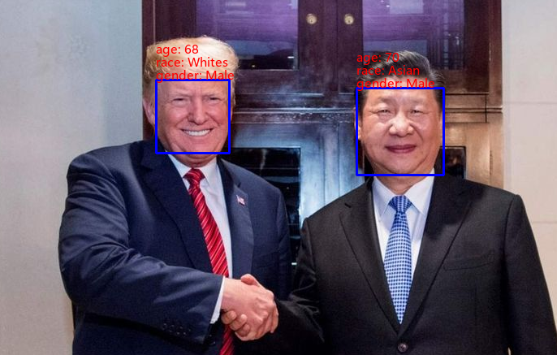
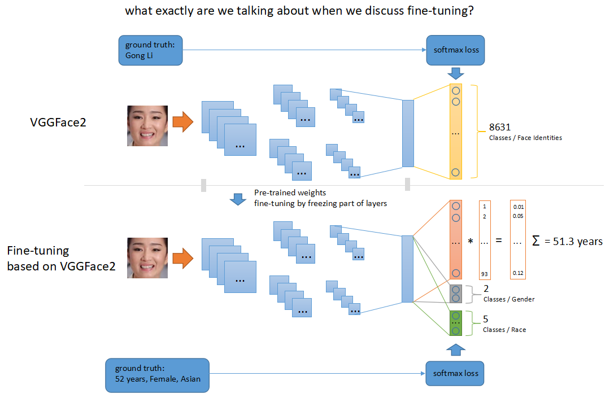
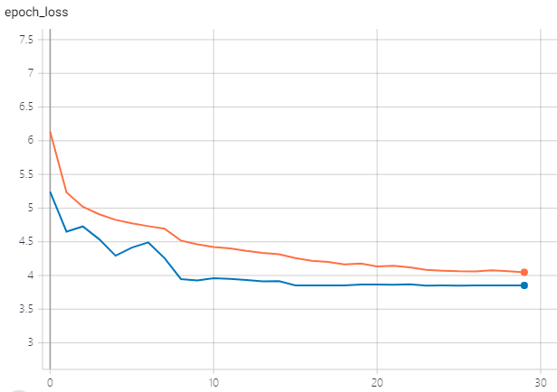
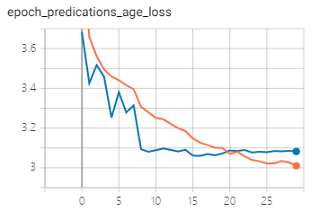
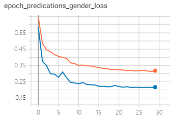
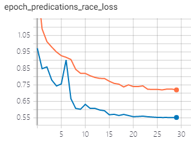
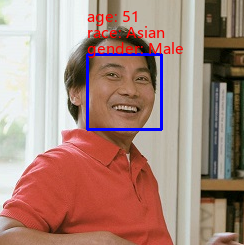
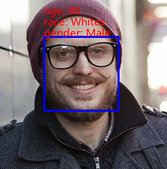
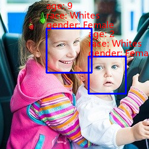
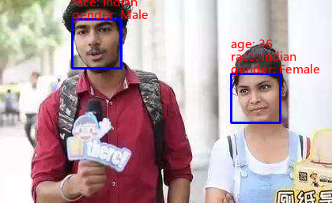

# Face_properties_based_on_vggface
This project is based on `keras_vggface`, which is mainly responsible for 2622 face identities classifications(VGGFace V1, vgg16 architecture inside) and 8631 face identities classifications(VGGFace V2, reset50/senet50 architecture inside).
> keras_vgg is a project implementing Oxford VGGFace Paper using keras 2.0+.

The main work in this repo is removing the top layers(mlp) from original vggface v2 networks(resnet50 inside) and finetune on `UTKFace` datasets to estimate age, gender and race from a single face image, which are 93(1 ~ 93 years old), 2(male and female), 5(whites, blacks, asian, indian and others) classifications task. The code runs on tensorflow 2.0 not keras.
> You can refer to the paper listed at the end of README.md to know about `why age estimation is a classification task instead of regression task`.

> Please move to [here](https://www.cnblogs.com/xiaozhi_5638/) if you are Chinese, WeChat gongzhonghao: `一级合格品` sharing articals about deep learning and computer vision.

# Dependencies
### libs:
- python 3.5
- tensorflow 2.1 (tf.keras)
- dlib, face_recognition (demo to detect faces in image)
- opencv 3
- scipy, numpy, h5py, pillow and so on

### Experiment environments on my office PC:
- windows 10
- python 3.5
- tensorflow-gpu 2.1
- cuda 10.0
- cudnn 7.5
- cpu i7-7700k 4.20 GHz
- gpu gtx 1080
- 16g ram

> It should work well on Ubuntu using corresponding config like above.

### Face datasets for fine-tuning:
UTKFace

### pre-trained weights on vggface v2
rcmalli_vggface_tf_notop_resnet50

# Usage
### face.py
define the new network architecture for fine-tuning. you should modify this file if you want to change the input_shape or the number of outputs or freeze more layers before training.
### face_train.py
train the new network using face datasets such as UTKFace to estimate age, gender and race. support data augmentation in training. you can modify the code to adapt to other datasets such as IMDB-WIKI etc.
### face_demo.py
demo for single image, modify input image path, and run `python face_demo.py` to estimate on a single image.
### face_video_demo.py
demo for video or usb camera, run `python face_video_demo.py` to estimate on frame from usb camera. you can also modify the code to read frame from video files.
### face_weights/
saving weights from ModelCheckPoint callback while fine-tuning.
### train_data/
face datasets such as UTFFace is in this folder.
### vggface_weights/
saving pre-trained vggface weights, the default network is resnet50(VGGFace V2), you can modify the code to use other architecture such as senet50 or vgg16.
### logs/
saving logs created by tensorboard.
### demo_images/
test images used for face_demo.py.
### fonts/
font file for Chinese.

# Training results

The hyper-parameters used for fine-tuning is in source code, nb_epoch is 30, input_shape is (200,200,3) and so on. You can check the code for more details and modify if necessary.

The training code has used some preprocess methods such as `mean subtraction`, mixup `data augmentation`. The val_loss being smaller than train_loss is because using data augmentation, this is normal phenomenon.The val_age_loss is always too high because age is too hard to distinguish, but it is OK, we would not use the neurons of highest probability to estimate age(please refer to related paper 1 at the end of README.md).
> The `load_data()` in face_train.py will load all data into RAM one time, you can modify the training code to load data in real time if you have not enough memery, such as using `fit_generator(...)` to fetch one batch of image data each time.

# Estimation results
The age estimation result is not good enough you can modify the data to do more research.

> The first three pictures is downloaded from http://www.how-old.net by Microsoft.

# References
### websites
- [keras_vggface](https://github.com/rcmalli/keras-vggface)
- [Oxford VGGFace](http://www.robots.ox.ac.uk/~vgg/software/vgg_face/)

### datasets
- [VGGFace Dataset](http://www.robots.ox.ac.uk/~vgg/data/vgg_face/) used for pre-trained weights (VGGFace V1)
- [VGGFace2 Dataset](http://www.robots.ox.ac.uk/~vgg/data/vgg_face2/) used for pre-trained weights (VGGFace V2)
- [UTKFace Dataset](https://susanqq.github.io/UTKFace/) used for fine-tuning in this repo

### papers
- [related paper1](https://www.cv-foundation.org/openaccess/content_iccv_2015_workshops/w11/papers/Rothe_DEX_Deep_EXpectation_ICCV_2015_paper.pdf) why age estimation is a classification task?
- [related paper2](http://www.robots.ox.ac.uk/~vgg/publications/2015/Parkhi15/parkhi15.pdf) about VGGFace dataset
- [related paper3](http://www.robots.ox.ac.uk/~vgg/publications/2018/Cao18/cao18.pdf) about VGGFace2 dataset
- [related paper4](https://arxiv.org/pdf/1503.03832.pdf) triplet loss in face recognition